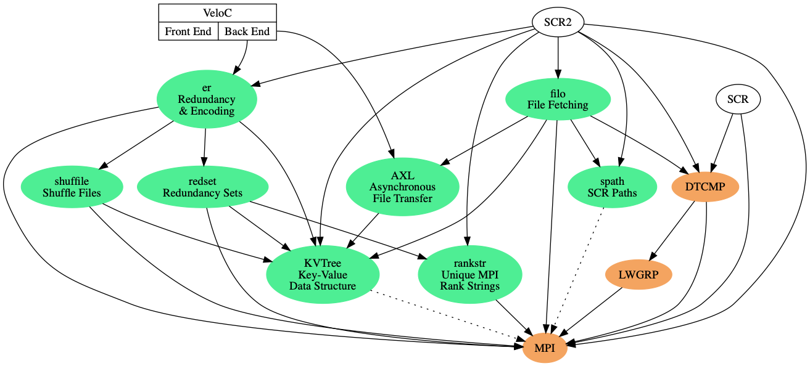

# Component Developer Documentation

This repository is for developer documentation related to various VELOC / SCR components.

## Status

All open issues for the components can be viewed on the [Components Project Board](https://github.com/orgs/ECP-VeloC/projects/1).

Repo | Version | Docs? | Testing? | Travis CI
-----|---------|-------|----------|----------
[KVTree](https://github.com/ecp-veloc/kvtree) | ? | ? | :heavy_check_mark: | 
[AXL](https://github.com/ecp-veloc/axl) | ? | ? | :heavy_check_mark: | 
[spath](https://github.com/ecp-veloc/spath) | ? | ? | :heavy_check_mark: | 
[filo](https://github.com/ecp-veloc/filo) | ? | ? | :heavy_check_mark: | 
[shuffile](https://github.com/ecp-veloc/shuffile) | ? | ? | :heavy_check_mark: | 
[redset](https://github.com/ecp-veloc/redset) | ? | ? | ? | 
[er](https://github.com/ecp-veloc/er) | ? | ? | ? | 
[rankstr](https://github.com/ecp-veloc/rankstr) | ? | ? | ? | 

## Components Diagram

# Component Descriptions

## Basic Data Structures and Algorithms

### [KVTree](https://github.com/ecp-veloc/kvtree): Recursive key-value structure

Documentation:
- [Overview](https://github.com/ecp-veloc/kvtree/blob/master/doc/rst/users/overview.rst)
- [API](https://github.com/ecp-veloc/kvtree/blob/master/doc/rst/users/api.rst)
- [Gather/Scatter](https://github.com/ecp-veloc/kvtree/blob/master/doc/rst/users/gatherscatter.rst)
- [File Format](https://github.com/ecp-veloc/kvtree/blob/master/doc/rst/users/fileformat.rst)
- [Debugging](https://github.com/ecp-veloc/kvtree/blob/master/doc/rst/users/debugging.rst)
- [Related SCR dev doc](https://scr-dev.readthedocs.io/en/latest/developers/hash.html)

Each KVTree object contains a list of key/value pairs.
Each key is a string, each value is another kvtree object.
This is a nested data structures, similar to a python dict or perl hash.
The library provides functions to serialize a kvtree object to / from a file.
It also optionally provides MPI send / recv functions to transfer an object from one process to another.

### [spath](https://github.com/ecp-veloc/spath): represent and manipulate file system paths

Documentation:
- [Overview](https://github.com/ecp-veloc/spath/blob/master/doc/rst/spath.rst)
- [Related SCR dev doc](https://scr-dev.readthedocs.io/en/latest/developers/path.html)

Create an spath object from a string.
The library includes functions to extract components (such as dirname, basename).
It can create an absolute path or compute a relative path from a source path to a destination path.
It can also simplify a path (i.e., convert `../foo//bar` to `foo/bar`).

### [rankstr](https://github.com/ecp-veloc/rankstr): splits processes into groups based on a set of process which have the same input string

Rankstr uses bitonic sort for a scalable method to identify process groups.
It is useful to create a communicator of ranks that all share the same storage device, then rank 0 in this communicator can create directory and inform others that dir has been created with barrier.
It is also used to split processes into groups based on failure group (failure group of NODE --> splits MPI_COMM_WORLD into subgroups based on hostname).

## File transfers between cache and parallel file system

### [AXL](https://github.com/ecp-veloc/axl): Asynchronous transfer library

Documentation:
- [Overview](https://github.com/ecp-veloc/axl/blob/master/doc/README.md)
- [Internal Data Structure](https://github.com/ecp-veloc/axl/blob/master/doc/file_lists.md)
- [Related SCR dev doc](https://scr-dev.readthedocs.io/en/latest/developers/file_transfer.html)

AXL is used to transfer a file from one path to another using synchronous and asynchronous methods.
This can only be done between storage tiers, AXL does not (yet) support movement within a storage tier (such as between 2 compute nodes).
Asynchronous methods include via pthreads, IBM BB API, Cray Datawarp.
AXL will create directories for destination files.

### [FILO](https://github.com/ecp-veloc/filo): File flush and fetch, coordinating file transfers with MPI

Documentation:
- [SCR dev docs: flush](https://scr-dev.readthedocs.io/en/latest/developers/flow_flush.html)
- [SCR dev docs: rank2file](https://scr-dev.readthedocs.io/en/latest/developers/file_rank2file.html)

Each process in a communicator registers a list of source and destination paths.
FILO then computes the union of destination directories and creates them in advance, using minimal mkdir() calls.
It executes AXL transfers, optionally using a sliding window for flow control.
It will record ownership map of which rank flushed which file (in the rank2file file).
This is used to fetch those files back to owner ranks during a restart.

## Redundancy Encoding/Decoding and File Migration

### [Redset](https://github.com/ecp-veloc/redset): Encode/decode a set of files with a redundancy method

Documentation:
- [SCR dev docs: redundancy descriptors](https://scr-dev.readthedocs.io/en/latest/developers/redundancy_descriptors.html)
- [SCR dev docs: Encoding schemes](https://scr-dev.readthedocs.io/en/latest/developers/schemes.html)
- [SCR dev docs: XOR scheme](https://scr-dev.readthedocs.io/en/latest/developers/scheme_xor.html)

Redset will create the redundancy data needed for a set of files.
It can rebuild a file with provided redundancy information.

### [Shuffile](https://github.com/ecp-veloc/shuffile): Shuffle files between MPI ranks

Documentation:
- [SCR dev docs: Scatter filemaps](https://scr-dev.readthedocs.io/en/latest/developers/flow_api.html#scr-scatter-filemaps)

Files are registered with
Used during restart, shuffile will move a file to the 'owning' MPI rank.

### [ER](https://github.com/ecp-veloc/er): Encode + Rebuild

ER is the abstraction of shuffile and redset into a single interface, SCR and VeloC use both and er to simplify the rebuilding steps.
On a restart, shuffile is used to first move files back to owning ranks, depending on new rank-to-node mapping.
Then redset is used to rebuild missing files after the shuffle.
