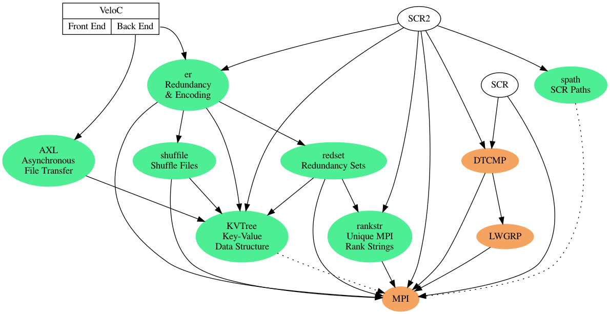

# Component Developer Documentation

This repository is for developer documentation related to various VELOC / SCR components.

## Status

Repo | Version | Docs? | Testing?
-----|---------|-------|---------
[KVTree](https://github.com/ecp-veloc/kvtree) | ? | ? | ?
[AXL](https://github.com/ecp-veloc/axl) | ? | ? | ?
[spath](https://github.com/ecp-veloc/spath) | ? | ? | ?
[filo](https://github.com/ecp-veloc/filo) | ? | ? | ?
[shuffile](https://github.com/ecp-veloc/shuffile) | ? | ? | ?
[redset](https://github.com/ecp-veloc/redset) | ? | ? | ?
[er](https://github.com/ecp-veloc/er) | ? | ? | ?

## Components Diagram

# Component Descriptions

## Basic Data Structures and Algorithms

### [KVTree](https://github.com/ecp-veloc/kvtree): Recursive key-value structure

Documentation:
- [Overview](https://github.com/ecp-veloc/kvtree/blob/master/doc/rst/users/overview.rst)
- [API](https://github.com/ecp-veloc/kvtree/blob/master/doc/rst/users/api.rst)
- [Gather/Scatter](https://github.com/ecp-veloc/kvtree/blob/master/doc/rst/users/gatherscatter.rst)
- [File Format](https://github.com/ecp-veloc/kvtree/blob/master/doc/rst/users/fileformat.rst)
- [Debugging](https://github.com/ecp-veloc/kvtree/blob/master/doc/rst/users/debugging.rst)
- [Related SCR dev doc](https://scr-dev.readthedocs.io/en/latest/developers/hash.html)

Each KVTree object contains a list of key/value pairs.
Each key is a string, each value is another kvtree object.
This is a nested data structures, similar to a python dict or perl hash.
The library provides functions to serialize a kvtree object to / from a file.
It also optionally provides MPI send / recv functions to transfer an object from one process to another.

### [spath](https://github.com/ecp-veloc/spath): represent and manipulate file system paths

Documentation
- [Overview](https://github.com/ecp-veloc/spath/blob/master/doc/rst/spath.rst)
- [Related SCR dev doc](https://scr-dev.readthedocs.io/en/latest/developers/path.html)

Create an spath object from a string.
The library includes functions to extract components (such as dirname, basename).
It can create an absolute path or compute a relative path from a source path to a destination path.
It can also simplify a path (i.e., convert `../foo//bar` to `foo/bar`).

### [rankstr](https://github.com/ecp-veloc/rankstr): splits processes into groups based on a set of process which have the same input string

Rankstr uses bitonic sort for a scalable method to identify process groups.
It is useful to create a communicator of ranks that all share the same storage device, then rank 0 in this communicator can create directory and inform others that dir has been created with barrier.
It is also used to split processes into groups based on failure group (failure group of NODE --> splits MPI_COMM_WORLD into subgroups based on hostname).
